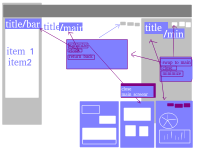

## About
 - _В чем смысл?_
    
    >Смысл в том, чтоб среди сообщества собрать людей в команду, которая создаст собственное издание и поделится им с этим же сообществом.
          
- _Как?_

    >Вы регистрируетесь, добавляете предпочтения в плане журналов или газет, система определяет основные интересы, которые нужно дополнить, подтвердить или убрать и последний шаг - определение желаемой роли, если вы не по инвайту из уже существующего издания на определенную роль, и 
    времени, которое вы готовы уделять в неделю на эту роль. Бам!
    
    >Подтягиваются возможные контакты с почты, предлагаются в сворачиваемом окошке, типа чата...

        вообще, все окошки должны иметь возможность быть свернутыми в превью, типа чата - с возможностью упрощения интерфейса до минимальных действий.
 
    # vot tak 

    >Получаете список редакций, которым вы максимально подходите и они ищут человека на эту роль. Фильтруете, ищете... 2 списка : общий рейтинг и с теми, кто ищет.

    >Заполняете профиль своей инфой, портфолио, если есть и подаете заявку на замещение должности:)

## PARTS 

- Users
    - Roles
    - Auth

- Registration
    - Interactive

- Company 
    - Magazines
    - Team
    - Inbox
    - Statistics
    - Budget
    - Positions
    - About

- Magazine
    - About
    - Type
    - Layout/Template
    - Roster
    - Vacancies
    - Tasks
    - Calendar
    - Statistics

- Social
    - Feed
    - Friends
    - Colleagues
    - Messages
    - Chatrooms
    - Insides
    - Trends
    - Top

- Personal
    - Bio
    - Portfolio
    - Interests
    - Job
    - Contracts
    - Calendar
    - Budget 
    - Contacts
    - Following

## At start I want to do:

- Auth
- Manage teams

- Manage edition
- Messages feature
- Personal information
- Roles in roster
- Roles in team
- News Feed
- Following feature